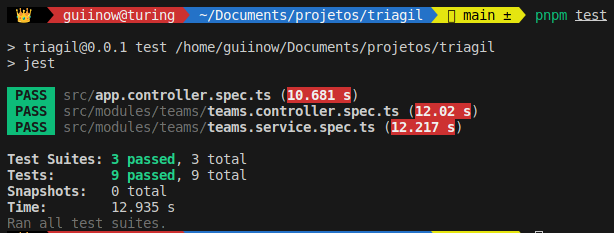
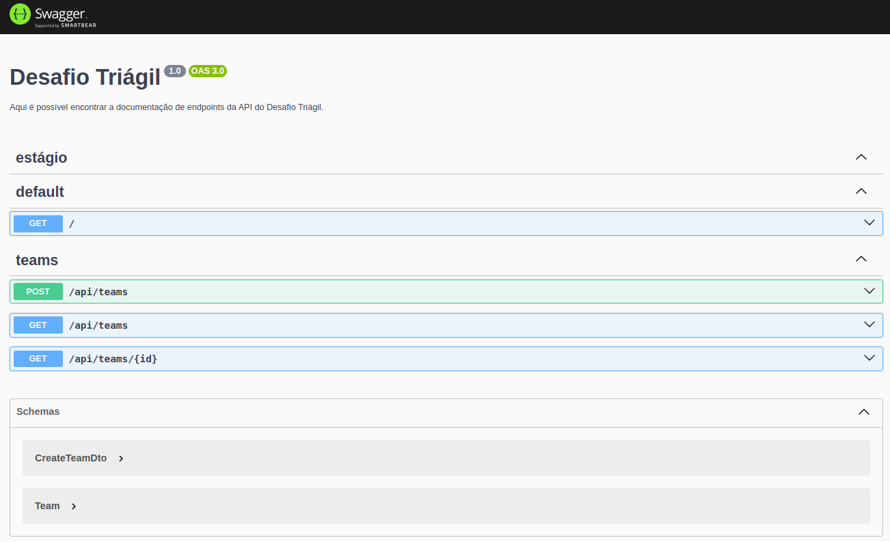
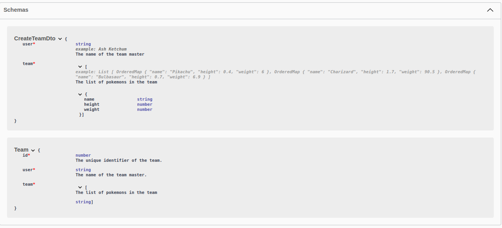
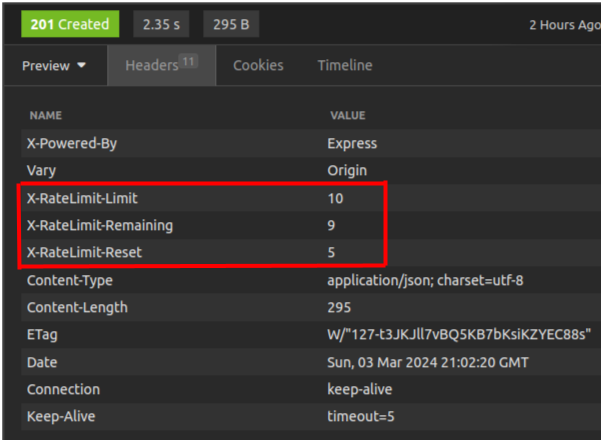
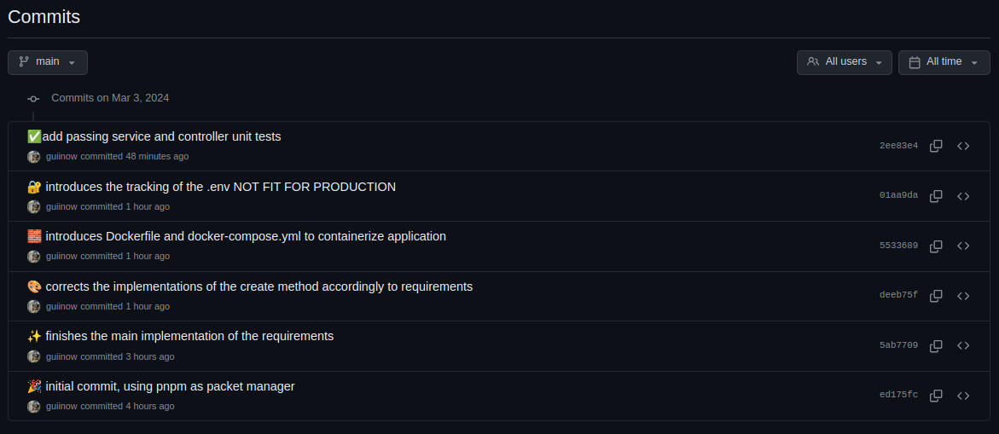
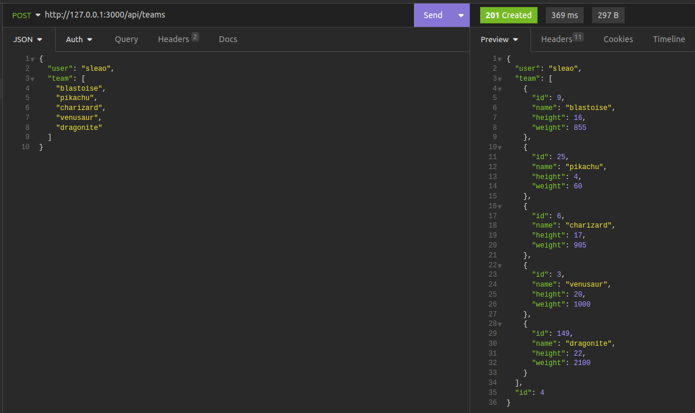
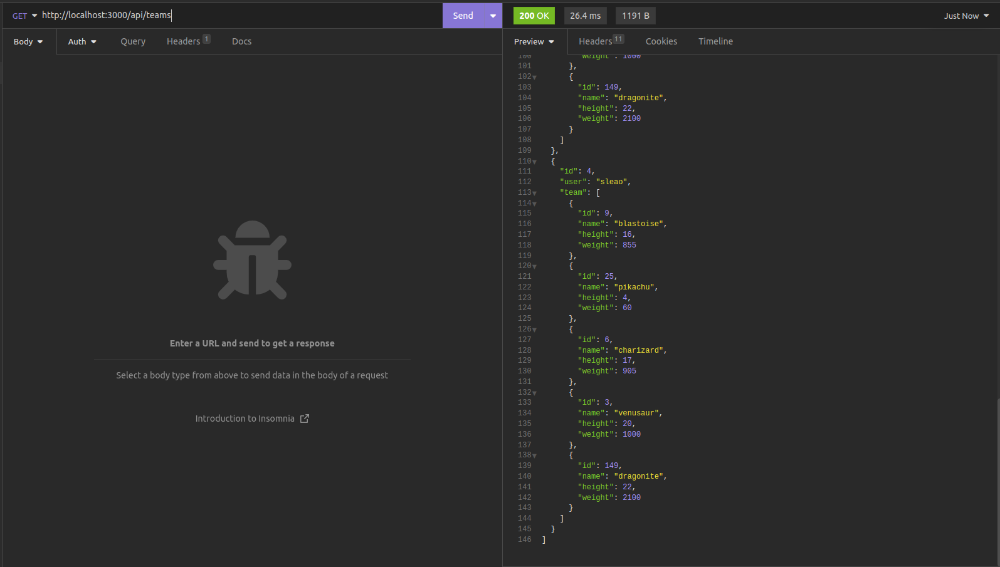
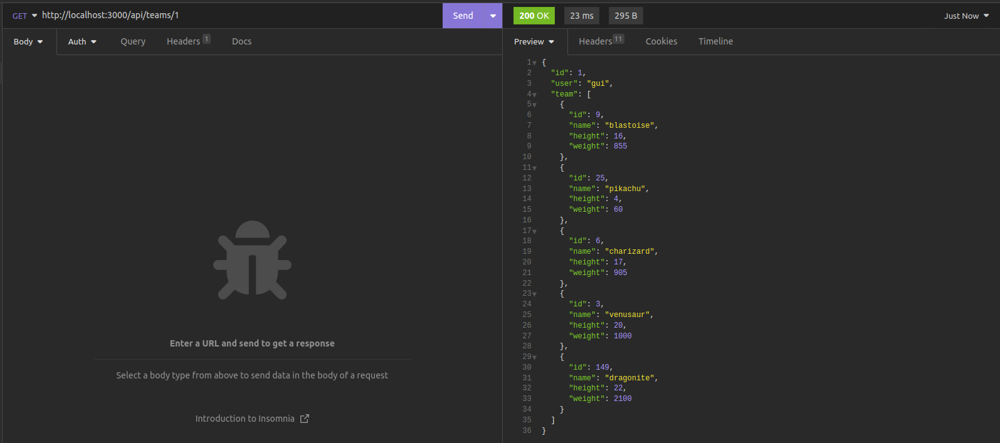

# Projeto Pokémon API

[Guilherme Ferreira](https://www.linkedin.com/in/guiiferreira/)

Esta aplicação web foi desenvolvida usando NestJS com TypeScript, para persistência de dados eu utilizei o PostgreSQL.

## Recursos

1. **Testes Unitários:** Foram escritos testes unitários para todos os métodos do *teams.service* e *teams.controller*.


2. **Swagger:** Para documentação de endpoints, foi utilizado o Swagger. Esta página é acessível atráves da rota `http://127.0.0.1:3000/docs`, com a aplicação em execução. Perceba que nesta mesma página é possível testar os endpoints.



3. **Limitação de Taxa de Requisições:** Eu implementei limitação de taxa de requisições para prevenir consumo intenso da API Pokémon. Esta API não especifica um limite de taxa, mas pede [aqui](https://pokeapi.co/docs/v2#:~:text=No%20authentication%20is%20required%20to%20access%20this%20API%2C%20and%20all%20resources%20are%20fully%20open%20and%20available.%20Since%20the%20move%20to%20static%20hosting%20in%20November%202018%2C%20rate%20limiting%20has%20been%20removed%20entirely%2C%20but%20we%20still%20encourage%20you%20to%20limit%20the%20frequency%20of%20requests%20to%20limit%20our%20hosting%20costs.) aos usuários que não abusem do serviço. Abaixo segue cabeçalho HTTP mostrando o limite de taxa:


1. Este projeto foi desenvolvido individualmente, então não foi necessário o uso de *Branches*, *Pull requests* ou *Code Review*. No entanto, eu estou familiarizado com essas práticas e as utilizo em projetos de equipe.
2. O arquivo `.env` com credênciais sensíveis está sendo rastreado no repositório *git* no *Github* porque este é um projeto conceitual e não um sistema para produção. 
3. Este projeto utiliza pnpm. O pnpm é um gerenciador de pacotes que oferece desempenho rápido e eficiente em termos de espaço e facilita a visualização das dependências.
4. **Padronização de Commits:** Para padronização de commits, eu segui o [gitmoji](https://gitmoji.dev/). 

## Endpoints

### Criação de Time

Rota para criação de um time.

**Método:** POST  

**Endpoint:** /api/teams

#### Exemplo de Requisição

```bash
curl --request POST \
  --url http://localhost:3000/api/teams \
  --header 'Content-Type: application/json' \
  --header 'accept: application/json' \
  --data '{
  "user": "sleao",
  "team": [
    "blastoise",
    "pikachu",
    "charizard",
    "venusaur",
    "lapras",
    "dragonite"
  ]
}'
```
### Listagem de Times
Rota para listar todos os times registrados.

**Método:** GET

**Endpoint:** /api/teams

#### Exemplo de Requisição

```bash
curl --request GET \
  --url http://localhost:3000/api/teams \
  --header 'Content-Type: application/json' \
  --header 'accept: application/json'
```

### Listagem de Time por Usuário
Rota para listar um time específico de um usuário.

**Método:** GET

**Endpoint:** /api/teams/:user

#### Exemplo de Requisição

```bash
curl --request GET \
  --url http://localhost:3000/api/teams/sleao \
  --header 'Content-Type: application/json' \
  --header 'accept: application/json'
```


## Execução do projeto

1. Clone o repositório do *Github*:

```bash
https://github.com/guiinow/triagil.git
```

2. Para rodar a aplicação, basta executar o seguinte comando:

```bash
docker-compose up
```
Uma vez que o projeto foi dockerizado, o banco de dados PostgreSQL será inicializado automaticamente.


## Resultados
- POST /api/teams - Rota para criação de um time, que recebe um JSON com o nome do usuário e um array com os nomes dos pokémons.


- GET /api/teams - Deverá listar todos os times registrados.


- GET /api/teams/{user} - Busca um time registrado por usuário

